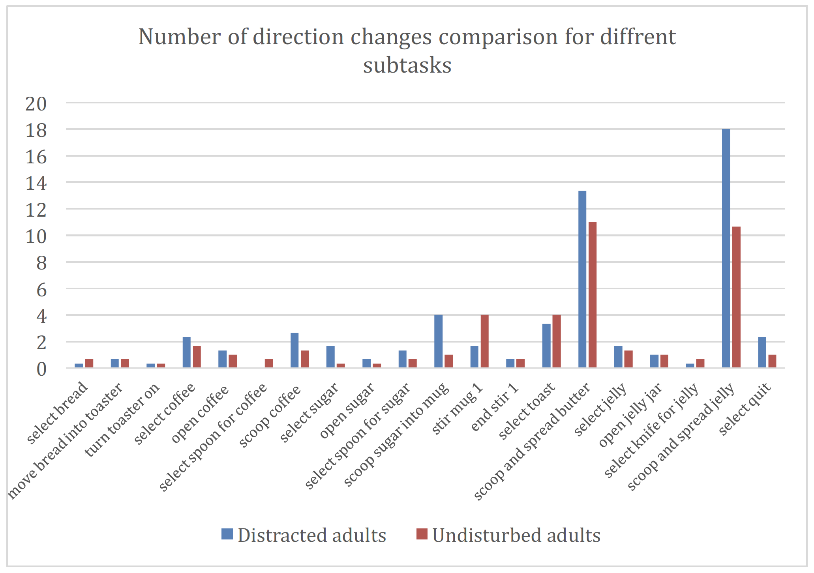

# MCI_Analysis
The MCI analysis toolkit contains a python program to process formatted .csv files with acceleration data to detect MCI suggestive abnormal movement patterns.

## Introduction

>MCI is an intermediate stage of brain malfunction between normal aging and more serious
dementia, of which the most common one is Alzheimer’s disease. Current diagnosis relies
heavily on clinical observations which is usually time-consuming. Effective computer aided MCI
classification therefore is much desired in facilitate the diagnosis process.

>Body motion detection using accelerometers has drawn considerable attention as an alternative
of visual information based movement recognition. With accelerometers, we can collect motion
data including azimuth, pitch, roll, and acceleration along x, y and z rotation vectors of the
device. Different patterns of movements yield different results, it’s thus logically possible to
reversely calculate the corresponding motion based on the given acceleration data.

>The most distinguishable features from the clinical
observations are pauses and sudden moves. During the laboratory assessments, the patients wear
a smartwatch that collects acceleration data. We then feed the data into our classification
algorithms to analyze if there are suspicious movement patterns such as more pauses and
direction changes. The results of our analysis suggest that MCI patients pause and change
directions more often based on the patterns of their hand movements. Certain subtasks are
complicated and require more attention than other tasks, and MCI patients are prone to make
more mistakes that resulting in more direction changes and pauses that can be reflected from the
acceleration data. Some of these subtasks are identified in our study and we believe the research
is beneficial in cutting down the time and resources put into clinical MCI diagnosis.
As an initial exploration, our goal in this study is to find the difference of movement patterns between MCI patients and
normal people, thus providing more clues that leads to successful MCI diagnosis.

## Data collection and preprocessing
>All the data are from clinical tests. They are collected using a smartwatch our subjects wear on
their wrists. The tests are designed specially to test the subjects’ cognitive capabilities. Table 1
below shows a sample subset of the data:

Table 1 Acceleration data sample of an adult subject preparing a lunch

>The data are trimmed to remove data segments with missing labels or out of assessment time
frames. Some subtasks are omitted by our participants during the assessment and data pertaining
to those tasks were removed for convenient analysis, since we’re only interested in the subtasks
we can compare across different subjects.
## Results and Analysis
1. Number of pauses

Figure 1. A comparison of number of pauses between distracted adults and undisturbed adults
with n = 0 and w = 15.
>The above figure shows the number of pauses comparison after we used refined parameters. The
number of pauses differs significantly between that of distracted adults and undisturbed adults.
It’s evidential that pauses are an effective factor to look into in MCI diagnosis. Also, subtasks
that show a sharp comparison between number of pauses from distracted adults and those from
undisturbed people, such as “scoop and spread butter”, can be used as “marker” subtasks to
facilitate lab assessment.
2.Number of direction changes
>Although the results from distracted adults and undisturbed adults is not in as sharp comparison
with each other as in the case of number of pauses, we can still see that for most of the subtasks,
there are more direction changes from distracted adults. Subtasks such as “scoop and spread
jelly”, and “scoop sugar into mug” are also good indicator to be chosen to facilitate laboratory
assessment of MCI.

Figure 2 A comparison of number of direction changes in different subtasks between distracted
adults and undisturbed adults with min_dist = 10.5 and thres = 0.5.
## Conclusion
>In this research, we have investigated using acceleration data analysis to recognize motions. The
results illustrate that certain subtasks are indicative of MCI mental issues. This can be helpful for
initial scan of the clinical MCI assessment, since doctors can have the options of looking at a few
subtasks first, instead of having to go through subtask detail. The approach of using number of
pauses and direction changes is successful in roughly classing MCI prone people from healthy
adults. If more data is collected in the future, the problem can be further analyzed with machine
learning algorithm to provide further insights into facilitating laborious clinical MCI assessment
